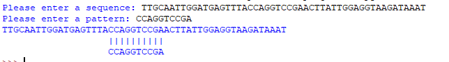

# ORF Detection

> Python3 simple pattern finder inside dna sequence

## Prerequisites

*   Python 3

## Usage

1.  `python3 pattern.py`
2.  input your dna sequence in terminal
3.  input the pattern you're searching for

